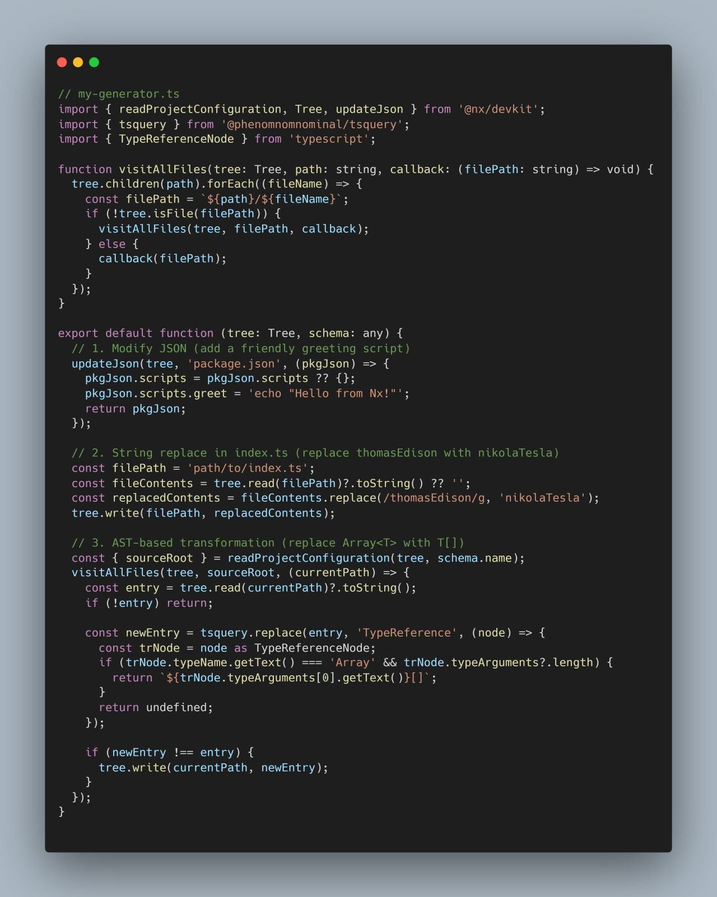

+++
date = '2025-01-28T02:34:05+01:00'
draft = false
title = 'Refactor Code Automatically With Nx'
categories = ['nx']
+++

[LinkedIn Post](https://www.linkedin.com/feed/update/urn:li:activity:7288495816602714114/?origin=NETWORK_CONVERSATIONS&midToken=AQGtNziulbkvSA&midSig=3hqbnnwm1w_XA1&trk=eml-email_network_conversations_01-network~post~cta-0-read~more&trkEmail=eml-email_network_conversations_01-network~post~cta-0-read~more-null-7uvmz7~m6fec1p3~14-null-null&eid=7uvmz7-m6fec1p3-14&otpToken=MTYwMjFiZTExMDI5YzFjNmIzMjQwNGVkNDUxNmU3YjQ4YWNmZDM0NzlhYWI4ODYxNmNjMDA5NmE0NjUzNTRmNmYzZDNkZjgxNGNjNmM3ZTY0M2Y4ZDlmNGJlZDNiNTlmYjIwYmU1NjljODM4NTFiZGEyOWEyZiwxLDE%3D
)

Refactor your code automatically at scale with hashtag#Nx generators 👀 

One of my favorite Nx features is generators. They are comparable with Angular Schematics, Nx generators are framework-agnostic and have the superpower of easily traversing your entire Nx monorepo and making modifications at scale a breeze 🍃 

Commonly, generators are used to generate new code, but they can also be used to refactor your code at scale. No more modifying hundreds of files by hand, simply write a generator and see the magic happen 🏗️ 

Here’s a quick rundown on how you can save yourself hours of repetitive work using Nx Generators—even when the files you’re modifying get a little complicated. 🤖 

1️⃣ Compose Existing Generators – If a generator already handles half your job, don’t reinvent the wheel! Use that existing functionality and build on top of it.

2️⃣ Modify JSON Files – JSON files are relatively easy to update thanks to their predictable structure. Simply locate the file and the JSON property you want to modify and assign it a new value as you would do with any JSOn object. Nothing too fancy here.

3️⃣ Using string Replace – If you have files with a bit more variety than a JSOn file, you can read the content as a string and use String Replace with a RegEx. While this does work, you should be careful with this option. Replacing a string value can accidentally modify something you didn't intend to change. For example, if you match 'myValue', you might also match 'myValuesWithOtherValue' and change part of some other variable you didn't intend.

4️⃣ AST Manipulation – An Abstract Syntax Tree (AST) is a structured representation of your code. Think of it like a blueprint showing where each piece of code lives, how they connect, and what they mean. You can surgically change code elements by tapping into an AST without accidentally altering comments or unrelated variables. Tools like TSQuery let you target AST nodes with a CSS selector-like syntax—so you can confidently transform your code. For example, changing Array<string> into string[] (and much more) while keeping your code intact and bug-free. 

